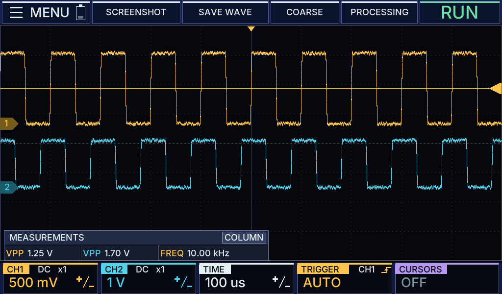

# Oscill — двухканальный осциллограф

Самодельный осциллограф с интерфейсом 1024 × 600, сенсорным экраном и физическими энкодерами. Проект объединяет приложение на C, платформу Zynq-7020, контроллер управления STM32 и основную плату в Altium Designer.

## Возможности

- два канала, запуск по фронту, режимы AUTO, NORMAL и SINGLE;
- измерения, курсоры, FFT и увеличение осциллограмм;
- управление касаниями, энкодерами и клавиатурой;
- сохранение и просмотр BMP и CSV;
- настольный симулятор для Windows и Linux.

## Плата

*Два входных тракта с AD9288, модуль Zynq, STM32 и семидюймовый экран.*

## Состав проекта

- [`ZYNQ7020/gui/`](ZYNQ7020/gui/) — интерфейс и настольный симулятор.
- [`ZYNQ7020/fpga/`](ZYNQ7020/fpga/) — HDMI и тракт захвата FPGA.
- [`ZYNQ7020/linux/`](ZYNQ7020/linux/) — Embedded Linux.
- [`STM32/`](STM32/) — органы управления.
- [`PCB/`](PCB/) — схемы, печатная плата и файлы изготовления.

Для проверки Zynq-7020 подготовлены тест DDR/HDMI и Linux с запуском GUI: [первый запуск](docs/BRINGUP.md). Подключение АЦП и STM32 находится в разработке.

Описание интерфейса — в [README GUI](ZYNQ7020/gui/README.md), устройство платы — в [README PCB](https://github.com/Coal56AB/OscilPCB/blob/5c4f6dd616d461db2b3ec94a01ae66af5781a7e2/README.md), сборка — в [документации разработчика](docs/BUILD.md).
