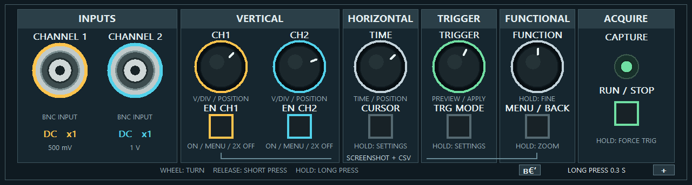

# OscilGUI

Интерфейс двухканального осциллографа для LCD 1024 × 600. Отрисовка написана на C и формирует готовый кадр RGB888, поэтому её можно встроить в проект прибора или запустить как настольный симулятор в Windows и Linux.

## Возможности

- два канала с независимыми масштабом, положением и связью AC/DC;
- развёртка от 500 нс/дел до 1 с/дел;
- запуск по фронту в режимах `AUTO`, `NORMAL` и `SINGLE`;
- до десяти измерений, временные и амплитудные курсоры;
- FFT с логарифмической шкалой, сглаживание, окраска по плотности и увеличение сохранённого захвата;
- управление с сенсорного экрана, клавиатуры или отдельной панели энкодеров;
- просмотр BMP и CSV, сохранение снимков экрана и отсчётов сигнала;
- сглаженный шрифт Inter и отдельный пиксельный режим для сравнения.

## Управление

Нижние карточки открывают настройки каналов, развёртки, триггера и курсоров. Масштаб и положение меняются энкодерами или жестами на графике. Верхняя панель содержит меню, снимок экрана, сохранение CSV, обработку сигнала и `RUN/STOP`.

Короткое нажатие энкодера выбирает действие, удержание вызывает дополнительную функцию. В симуляторе колесо мыши вращает энкодер, а клик имитирует нажатие. Основные действия также доступны клавишами `1`, `2`, `C`, `T`, `M`, `Space`, `Enter`, `F2` и `F3`.

## Сборка

### Windows

Нужны [MSYS2](https://www.msys2.org/), UCRT64 и CMake. Сборка использует WinAPI; команды приведены в [документации разработчика](../../docs/BUILD.md#windows).

Приложение автоматически использует отдельный дисплей 1024 × 600, если он подключён в режиме «Расширить». Панель управления остаётся на основном мониторе.

### Linux

Нужны CMake и SDL2. Команды для настольного Linux и ARM — в [документации разработчика](../../docs/BUILD.md).

Флаг `--windowed` принудительно включает оконный режим, а `--kiosk` открывает только LCD на весь экран.

## ASUS Tinker Board

Скрипт `tinker_board/build.sh` кросс-компилирует версии ARM32 и ARM64, а затем создаёт `output/tinker/OscilGUI-TinkerBoard.zip`. Архив не хранится в Git. После сборки распакуйте его на накопитель и запустите `START.desktop` — компилятор на плате не нужен.

Инструкция по самостоятельной сборке находится в [`tinker_board/BUILDING.md`](tinker_board/BUILDING.md).

## Встраивание

Для интеграции в устройство используются библиотека `scope_screen` и её заголовок `src/scope_screen.h`. Функция `scope_screen_render()` принимает состояние интерфейса и осциллограммы, затем формирует кадр 1024 × 600.

Описание структур данных и пример вызова приведены в [`DEVELOPMENT.md`](DEVELOPMENT.md). Сборка для Zynq — в [документации проекта](../../docs/BUILD.md).
